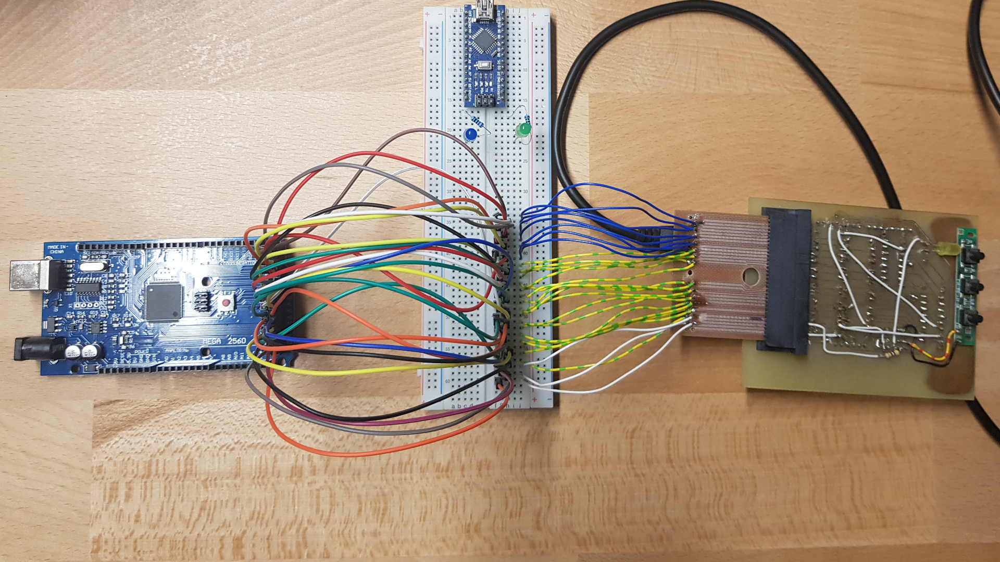
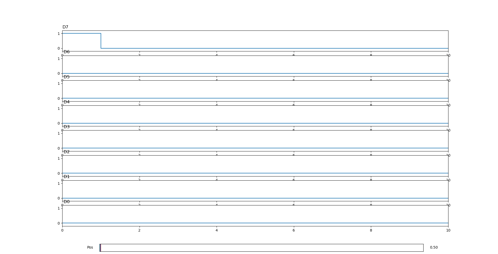

Arduino Logic Analyzer
======================

A simple logic analyzer, which can be used with any Arduino and Python3.

* Upload the firmware.ino sketch to your Arduino
* Find out to which COM-Port your device is connected
* Adjust the COM-Port in `interface.py`
* Run `interface.py` to record data from arduino and plot the result
* You can also open serial interface (e.g. over arduino ide) can copy the received data in a csv-file
* You can then plot with `plot.py`

Hints:
* You can choose your pins in the Arduino sketch
* You can choose your sampling rate in the Arduino sketch

## Example

This is how an example application could look like:

The resulting plot could look like this:

